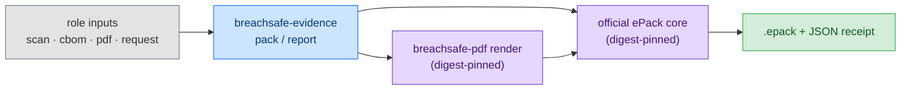

<!-- SPDX-License-Identifier: PolyForm-Noncommercial-1.0.0 -->

# BreachSAFE Evidence Go

[](https://go.dev/)
[](LICENSE)
[](https://github.com/paul007ex/breachsafe-evidence-go/actions/workflows/ci.yml)
[](https://github.com/paul007ex/breachsafe-evidence-go/actions/workflows/container.yml)
[](https://github.com/paul007ex/breachsafe-golden-go)

Take the artifacts a scan already produced (a CBOM, a QuReddy scan, a rendered PDF) and turn them
into one sealed, verifiable evidence pack. `breachsafe-evidence` is a thin CLI composer: it places
each input on a deterministic path, packages it through the official ePack core, and writes a JSON
receipt you can inspect, verify, extract, and diff.

It does one job and hands the rest to the tools that own them. Scanning is QuReddy. CBOM and OSCAL
are Mint-OSCAL. PDF rendering is `breachsafe-pdf`. The pack format is ePack. This repository wires
those together behind a small, auditable command surface.

## Table of contents

1. [What it is](#what-it-is)
2. [Architecture at a glance](#architecture-at-a-glance)
3. [The executable boundary](#the-executable-boundary)
4. [Container boundary](#container-boundary)
5. [Quickstart (copy and paste)](#quickstart-copy-and-paste)
6. [P0 acceptance test](#p0-acceptance-test)
7. [Local development](#local-development)
8. [Integration note](#integration-note)
9. [License](#license)

## What it is

`breachsafe-evidence` composes caller-supplied evidence through the latest official ePack core. It
does not scan, generate CBOM/OSCAL, render PDFs, or implement the ePack format. Those
responsibilities belong to QuReddy, Mint-OSCAL, `breachsafe-pdf`, and ePack.

Two commands do the work:

| Command | What it does |
|---|---|
| `pack` | Places role inputs under deterministic paths (`artifacts/cbom/`, `artifacts/pdf/`, `--other` under `artifacts/extra/`), validates the ePack inspection receipt before publication, and writes that JSON receipt to stdout. |
| `report` | Calls `breachsafe-pdf render --profile ...`, then packages the generated PDF, RenderResult, source inputs, and request through the same verified ePack path. |

Supporting commands round out the lifecycle: `inspect`, `verify`, `extract`, `unpack`, and `diff`.

## Architecture at a glance

One pipeline: role inputs go in, a sealed pack and a receipt come out. Every external tool it calls
is pinned by SHA-256 before it runs.



## The executable boundary

The boundary to every external binary is explicit and digest-pinned:

- `BREACHSAFE_EPACK_BIN` identifies the ePack binary. `BREACHSAFE_EPACK_SHA256` holds its approved
  SHA-256 digest. The published image supplies the digest at `/usr/share/breachsafe/epack.sha256`.
- The image also bundles the canonical `breachsafe-pdf` executable. Its digest and resolved source
  revision are recorded at `/usr/share/breachsafe/breachsafe-pdf.sha256` and
  `/usr/share/breachsafe/breachsafe-pdf.revision`.

A binary whose digest does not match the approved value never runs.

## Container boundary

`Dockerfile` uses the published GitHub golden Go image for compilation and emits a minimal runtime
image containing this CLI, the canonical `breachsafe-pdf` compiler, and the components-disabled
official ePack core built from the upstream `main` branches. The image records the resolved upstream
commits and carries both tools' license and NOTICE files.

The publish workflow disables Docker build cache so `EPACK_REF=main` and `PDF_REF=main` track the
current upstream tips on each image build. A scheduled rebuild keeps the `:latest` image fresh;
versioned image tags remain the audit and release references.

The image runs as UID 65532. For bind-mounted output directories, grant that directory write
permission or run with an explicit operator UID. Do not run the image privileged.

## Quickstart (copy and paste)

Put your input files in one directory, mount that directory at `/work`, then use paths beginning
with `/work/` inside the container.

```bash
# 1. Pull the published image.
docker pull ghcr.io/paul007ex/breachsafe-evidence-go:latest

# 2. Create a working directory and place your files there.
mkdir -p evidence-input
cp /path/to/scan.json evidence-input/scan.json
cp /path/to/cbom.json evidence-input/cbom.json
cp /path/to/report.pdf evidence-input/report.pdf
# For the report command, also provide a breachsafe-pdf render request.
cp /path/to/request.json evidence-input/request.json

# 3. Build an ePack. The JSON receipt is written to the terminal.
docker run --rm --user "$(id -u):$(id -g)" \
  -v "$PWD/evidence-input:/work" \
  ghcr.io/paul007ex/breachsafe-evidence-go:latest pack \
  --stream breachsafe/my-scan \
  --scan /work/scan.json \
  --cbom /work/cbom.json \
  --pdf /work/report.pdf \
  --output /work/evidence.epack

# 4. Verify the pack.
docker run --rm --user "$(id -u):$(id -g)" \
  -v "$PWD/evidence-input:/work" \
  ghcr.io/paul007ex/breachsafe-evidence-go:latest \
  verify --integrity-only /work/evidence.epack

# Or generate the PDF and package the complete result in one operation.
docker run --rm --user "$(id -u):$(id -g)" \
  -v "$PWD/evidence-input:/work" \
  ghcr.io/paul007ex/breachsafe-evidence-go:latest report \
  --profile breachsafe/community \
  --request /work/request.json \
  --cbom /work/cbom.json \
  --scan-json /work/scan.json \
  --pdf /work/report.pdf \
  --result /work/report.result.json \
  --stream breachsafe/my-scan \
  --output /work/evidence.epack

# 5. Inspect its manifest and digests.
docker run --rm --user "$(id -u):$(id -g)" \
  -v "$PWD/evidence-input:/work" \
  ghcr.io/paul007ex/breachsafe-evidence-go:latest \
  inspect --json /work/evidence.epack

# 6. Extract the artifacts into evidence-input/unpacked/.
mkdir -p evidence-input/unpacked
docker run --rm --user "$(id -u):$(id -g)" \
  -v "$PWD/evidence-input:/work" \
  ghcr.io/paul007ex/breachsafe-evidence-go:latest \
  unpack --all -o /work/unpacked /work/evidence.epack
```

The resulting files are:

```text
evidence-input/
├── evidence.epack
├── scan.json
├── cbom.json
├── report.pdf
└── unpacked/
    ├── artifacts/scan/scan.json
    ├── artifacts/cbom/cbom.json
    └── artifacts/pdf/report.pdf
```

## P0 acceptance test

The repository carries a small sanitized CBOM, QuReddy scan, and render-request fixture set in
`testdata/p0/`. The acceptance script generates all packs and PDFs in a temporary directory; no
generated evidence is committed. With approved ePack and PDF binaries available, run:

```bash
BREACHSAFE_EVIDENCE_BIN=./breachsafe-evidence \
  BREACHSAFE_EPACK_BIN=/absolute/path/to/epack \
  BREACHSAFE_EPACK_SHA256=<sha256> \
  BREACHSAFE_PDF_BIN=/absolute/path/to/breachsafe-pdf \
  BREACHSAFE_PDF_SHA256=<sha256> \
  ./scripts/p0_acceptance.sh
```

The script exercises `pack`, `report`, `inspect`, `verify`, `extract`, `unpack`, and `diff`, and
asserts the expected three-artifact pack and five-artifact report pack.

## Local development

Build the image from this checkout first:

```bash
docker build --pull --no-cache -t breachsafe-evidence-go:local .
```

Then replace `ghcr.io/paul007ex/breachsafe-evidence-go:latest` in the commands above with
`breachsafe-evidence-go:local`.

`--pull --no-cache` is intentional: it refreshes the golden Go base image and rebuilds the official
ePack binary from the current `EPACK_REF` instead of reusing an old Docker layer.

The image must be able to pull `ghcr.io/paul007ex/breachsafe-golden-go:1.26.6` while building. If
that package is private, authenticate Docker to GHCR first or use the published image.

Minimal smoke test:

```bash
docker run --rm --user "$(id -u):$(id -g)" \
  -v "$PWD:/work" -w /work \
  ghcr.io/paul007ex/breachsafe-evidence-go:latest version
```

## Integration note

The UX is not embedded in this image. `breachsafe-ux` may call this CLI in a later P2/P3 gateway
integration once the CLI contract is stable.

## License

`PolyForm-Noncommercial-1.0.0`. This repository is source-available for non-commercial use. See
[LICENSE](LICENSE). Third-party components (the official ePack core, `breachsafe-pdf`) keep their
own licenses and NOTICE files, which the image carries.
